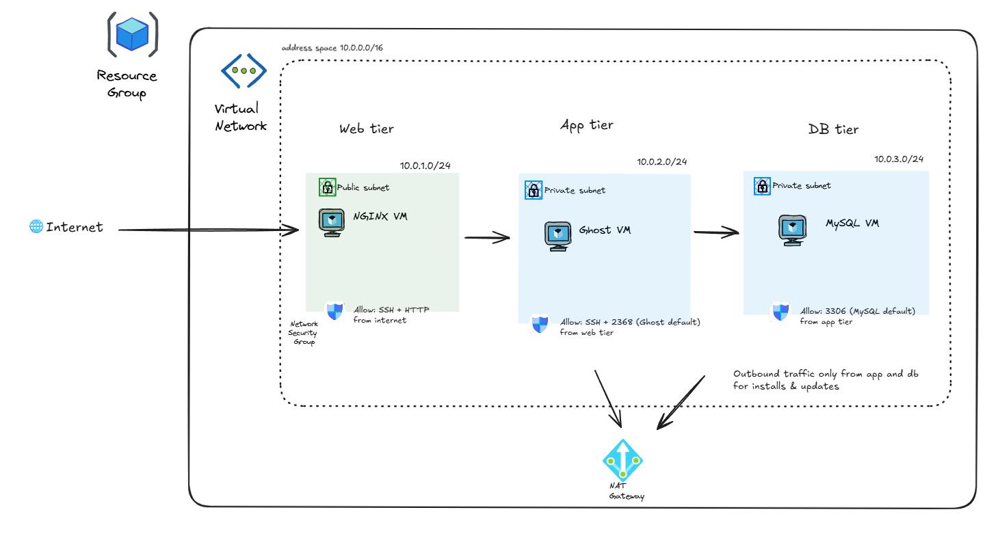

# Terraform: Ghost 3-Tier Deployment on Azure

**Stack:** Azure | Terraform | Ubuntu | Ghost CMS | Nginx | MySQL

This project demonstrates how to use **Terraform** to deploy a simple three-tier architecture on **Microsoft Azure**. The stack hosts [**Ghost**](https://ghost.org/), an open-source platform for publishing blogs and websites.


> [!NOTE] 
> This is a learner-friendly Terraform project built for clarity and demonstration purposes. It can be extended with remote state, CI/CD, and Key Vault integration for production-style deployments.


## Why?

When I started learning, I couldn't find a clean guide going through the process with the tools that I wanted to use. So I decided to create a simple guide how to use Terraform and Azure based on my own learning experience.

The repository is designed to help beginners learn **Infrastructure as Code (IaC)** concepts and workflow. It acts as a **hands-on experience** for people with some familiarity of cloud concepts.


You’ll deploy a real web app (Ghost CMS) using [Terraform to provision infrastructure automatically.](https://developer.hashicorp.com/terraform/tutorials/azure-get-started/infrastructure-as-code?in=terraform%2Fazure-get-started)
The environment follows a [**3-tier architecture**](https://www.ibm.com/think/topics/three-tier-architecture) with clear separation between presentation, logic, and data layers.

| Tier | Network Scope | Component | Description |
|------|----------------|------------|--------------|
| **Web Tier** | Public | **NGINX** | Acts as the entry point and reverse proxy for incoming HTTP traffic |
| **Application Tier** | Private | **Ghost CMS** | Hosts the Ghost blog and serves dynamic content behind NGINX |
| **Database Tier** | Private | **MySQL** | Stores Ghost’s content, users, and configuration data |


## 🏗️ Architecture

### Azure resources

- **Resource Group**
- **Virtual Network (VNet)** with 3 subnets:
  - `web-subnet` (public)
  - `app-subnet` (private)
  - `db-subnet` (private)
- **Virtual Machines (VMs)** one per tier:
  - ``nginx-vm`` (web tier)
  - ``ghost-vm`` (application tier)
  - ``mysql-vm`` (database tier)
- **Network Security Groups (NSGs)** for tier-specific firewall rules
- **NAT Gateway** for outbound Internet access from private subnets
- **Cloud-init** scripts for VM bootstrapping (installing NGINX, Ghost, MySQL)



## 📂 Repository Structure
```
azure-terraform-ghost-demo/
├── main.tf                # Resource group
├── providers.tf           # Provider configuration (Azure)
├── variables.tf           # Input variables
├── network.tf             # VNet + Subnets
├── security.tf            # NSGs + rules
├── compute.tf             # VM + NIC definitions
├── outputs.tf             # Terraform outputs (IP addresses)
├── terraform.tfvars       # Sensitive variables (excluded from Git)
├── .gitignore             # Excludes tfvars, state files, etc.
├── cloud-init/            # Cloud-init scripts
│   ├── ghost.yaml
│   ├── nginx.yaml
│   └── mysql.yaml
└── README.md              # Project documentation and guide

```
> ![!TIP]
> Cloud-init YAML files must begin with `#cloud-config` (no space) for Azure to interpret them correctly.

## ⚙️ Requirements

- Requirements were tested in Windows 11
- Azure subscription (Free, Student, or Pay-as-you-go)
- [Terraform ≥ 1.13.0](https://kodekloud.com/blog/easy-guide-to-install-terraform-on-windows/)
- [Azure CLI](https://learn.microsoft.com/en-us/cli/azure/install-azure-cli)
- [Visual Studio Code](https://code.visualstudio.com/)  
  + HashiCorp Terraform extension
- [Windows Terminal (built-in OpenSSH)](https://apps.microsoft.com/detail/9n0dx20hk701?hl=fi-FI&gl=FI)
- [SSH keypair for VM access](https://docs.exavault.com/using-exavault/users/ssh-key-authentication/creating-an-ssh-key-on-windows)  
  Default path: `C:\Users\<User>\.ssh\id_rsa.pub`

>[!TIP]
> [Azure for Students offers $100 in Azure credits, with no credit card required. Credit is valid for one year.](https://learn.microsoft.com/en-us/azure/education-hub/about-azure-for-students)

## 🚀 Getting Started

### 1. Login and verify Azure account
```bash
az login
az account show
```

### 2. Create `terraform.tfvars` file

In the root of the project created a file named `terraform.tfvars` and add your MySQL password:
```
mysql_password = "your_sql_pass_here"
```
This file contains sensitive data and **should not be committed to GitHub.** Add this to .gitignore (which is already configured in the repo).

### 3. Clone the repository
```bash
git clone https://github.com/<your-username>/azure-terraform-ghost-demo.git
cd azure-terraform-ghost-demo
```

### 4. Initialize Terraform
```bash
terraform init
```
### 5. Format and validate the configuration
Format your Terraform files to ensure consistent style and catch syntax issues
```bash
terraform fmt
terraform validate
```

### 6. Plan and deploy resources

```bash
terraform plan
terraform apply
```
Navigate to the [Azure portal](portal.azure.com) and **Dashboard** to validate deployed resources.


### 7. Destroy resources when done
```bash
terraform destroy
```

## 🔐 SSH Agent Forwarding

This setup uses Nginx VM as a jump host to access private VMs securely.

Private VMs (Ghost & MySQL) have no public IPs. SSH agent forwarding
allows you to "hop" securely from Nginx → Ghost → MySQL.

### Start the SSH agent
```powershell
Start-Service ssh-agent
ssh-add C:\Users\<User>\.ssh\<private-key>

# Verify key is loaded
ssh-add -l 
```

## Testing the VMs

### 1. Connect to Nginx VM
```bash
ssh -A azureuser@<nginx_public_ip>
```

### 2. Connect to Ghost VM
```bash
ssh azureuser@<ghost_private_ip>

```

### 3. Switch to Ghost user
```bash
sudo -u ghostuser -i
```
The Ghost CLI runs as a dedicated user (ghostuser), which is passed to cloud-init. All commands should be executed under it.

Ghost takes about 5 mins to setup. You can check the cloud-init progress with `sudo tail -n 100 /var/log/cloud-init-output.log`

---

### ⚠️ SSH Host Key Warning

> When a VM is re-created (after terraform destroy or re-apply), you may see:
*"WARNING: REMOTE HOST IDENTIFICATION HAS CHANGED!"*

This is normal, the VM has a new SSH fingerprint.
To fix, remove the old key:
```bash
ssh-keygen -R <vm_ip>
```
## 🔍 Verification & Testing Cheatsheet

Each test verifies a part of the infrastructure.

| Test                                           | Command                                              | Expected Result                                    |
| ---------------------------------------------- | ---------------------------------------------------- | -------------------------------------------------- |
| Cloud-init output | `sudo tail -n 100 /var/log/cloud-init-output.log`    | Shows Ghost installation and setup logs            |
| Cloud-init log (full details)              | `sudo less /var/log/cloud-init.log`                  | Displays all provisioning steps                    |
| Ghost service logs                         | `ghost log` (run as `ghostuser` in `/var/www/ghost`) | Shows live Ghost activity (requests, startup info) |
| Ghost status                               | `ghost ls`                                           | Ghost instance listed as “running”                 |
| Database connection                        | `mysql -h <mysql_private_ip> -u ghost -p` (run `SHOW DATABASES;`)            | `ghost_db` visible in output                       |
| NAT check                                  | `curl -I https://ghost.org` (from Ghost VM)          | `200 OK` confirms outbound Internet access         |
| Website check                              | `curl http://<nginx_public_ip>`                      | Returns Ghost homepage HTML                        |


> [!TIP]  
> These tests validate both **connectivity** and **security**.  
> Passing them means your NSGs, NAT, and subnet rules are correctly implemented and your 3-tier architecture behaves as intended.
>
> Remember to `terraform destroy` when you are done testing and poking around VMs.


## 📈 Considerations for a Better Product

This setups works well for learning Infrastructure as Code, but few additions could bring it closer to production-level quality.

### Ghost production readiness
  For a fully functional self hosted Ghost you would need to add the following:

  - Add a domain name for proper HTTPS and SSL setup
  - Configure an SMTP server to enable Ghost user registration and password recovery
---
### General improvements

💡 **Secrets Management (Azure Key Vault)**
- MySQL password is currently in a local `.tfvars` file which is fine for testing.
- In production secrets should be stored in Azure Key Vault and fetched dynamically by Terraform.

💡 **CI/CD with Github Actions** 

- Automate validation and deployment for smoother updates. Automation good!

*Learn more: [Building a workflow with GitHub Actions](https://resources.github.com/learn/pathways/automation/essentials/building-a-workflow-with-github-actions/)*

💡 **Service Principal for authentication**

- For simplicity, this guide uses interactive Azure CLI login (`az login`).
In production or CI/CD pipelines, you’ll want to authenticate Terraform using a Service Principal instead.

*Learn more: [AzureRM Provider Authentication](https://registry.terraform.io/providers/hashicorp/azurerm/latest/docs/guides/service_principal_client_secret#creating-a-service-principal)*

💡 **Remote Backend** 

- Store Terraform state in Azure Blob Storage to keep it safe and shareable between team members  

*Learn more: [Terraform Backend (azurerm)](https://developer.hashicorp.com/terraform/language/settings/backends/azurerm)*

💡 **Monitoring & Dashboards**  

- Add dashboards and alerts using Azure Monitor or Grafana to keep track of performance and diagnose issues faster.

*Learn more: [Azure Monitor overview](https://learn.microsoft.com/en-us/azure/azure-monitor/overview)*

💡 **Azure Bastion**

- Use Azure Bastion instead of public SSH access for more secure management of virtual machines without exposing public ip addresses.

*Learn more: [Azure Bastion](https://learn.microsoft.com/en-us/azure/bastion/bastion-overview)*

